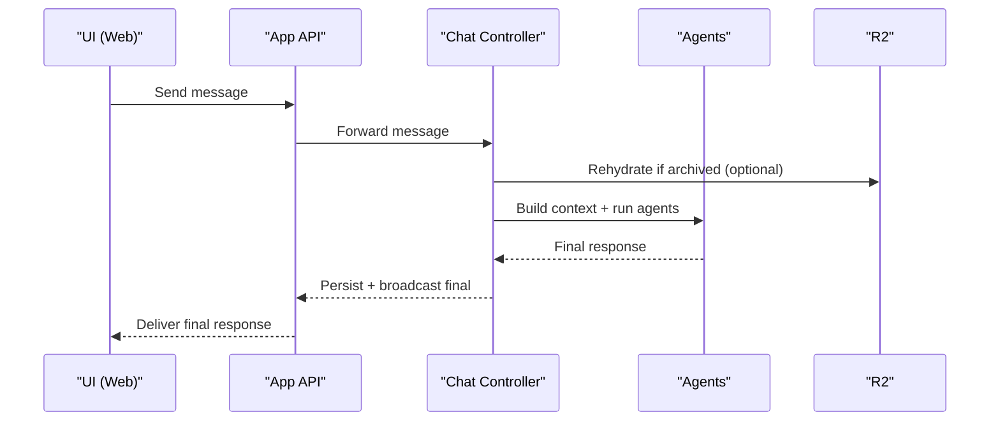
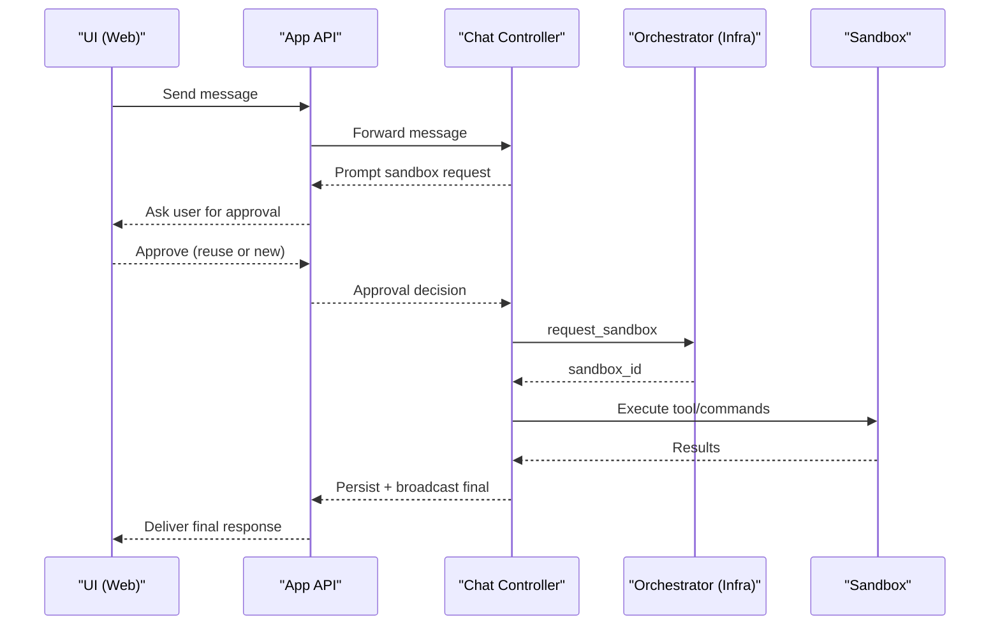
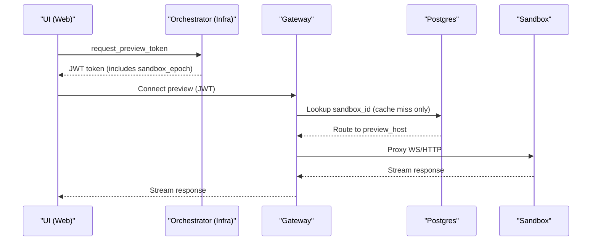
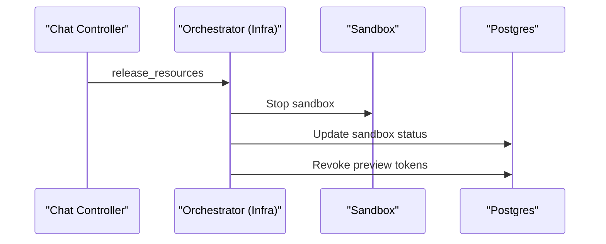
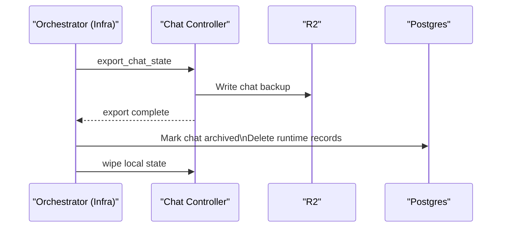
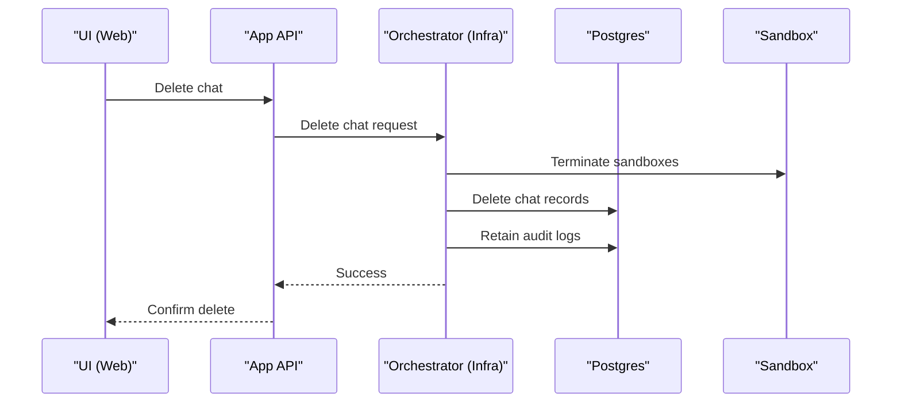

# Sequence Diagrams (MVP)

## Message Flow (No Sandbox)

```mermaid
sequenceDiagram
    participant UI as "UI (Web)"
    participant APP as "App API"
    participant CC as "Chat Controller"
    participant AG as "Agents"
    participant R2 as "R2"

    UI->>APP: Send message
    APP->>CC: Forward message
    CC->>R2: Rehydrate if archived (optional)
    CC->>AG: Build context + run agents
    AG-->>CC: Final response
    CC-->>APP: Persist + broadcast final
    APP-->>UI: Deliver final response
```

## Message Flow (Sandbox Required)

```mermaid
sequenceDiagram
    participant UI as "UI (Web)"
    participant APP as "App API"
    participant CC as "Chat Controller"
    participant ORCH as "Orchestrator (Infra)"
    participant SB as "Sandbox"

    UI->>APP: Send message
    APP->>CC: Forward message
    CC-->>APP: Prompt sandbox request
    APP-->>UI: Ask user for approval
    UI-->>APP: Approve (reuse or new)
    APP-->>CC: Approval decision
    CC->>ORCH: request_sandbox
    ORCH-->>CC: sandbox_id
    CC->>SB: Execute tool/commands
    SB-->>CC: Results
    CC-->>APP: Persist + broadcast final
    APP-->>UI: Deliver final response
```

## Preview Access (Gateway)

```mermaid
sequenceDiagram
    participant UI as "UI (Web)"
    participant ORCH as "Orchestrator (Infra)"
    participant GW as "Gateway"
    participant DB as "Postgres"
    participant SB as "Sandbox"

    UI->>ORCH: request_preview_token
    ORCH-->>UI: JWT token (includes sandbox_epoch)
    UI->>GW: Connect preview (JWT)
    GW->>DB: Lookup sandbox_id (cache miss only)
    DB-->>GW: Route to preview_host
    GW->>SB: Proxy WS/HTTP
    SB-->>GW: Stream response
    GW-->>UI: Stream response
```

## Idle Cleanup

```mermaid
sequenceDiagram
    participant CC as "Chat Controller"
    participant ORCH as "Orchestrator (Infra)"
    participant SB as "Sandbox"
    participant DB as "Postgres"

    CC->>ORCH: release_resources
    ORCH->>SB: Stop sandbox
    ORCH->>DB: Update sandbox status
    ORCH->>DB: Revoke preview tokens
```

## Long-Idle Archive (e.g., 2 days)

```mermaid
sequenceDiagram
    participant ORCH as "Orchestrator (Infra)"
    participant CC as "Chat Controller"
    participant R2 as "R2"
    participant DB as "Postgres"

    ORCH->>CC: export_chat_state
    CC->>R2: Write chat backup
    CC-->>ORCH: export complete
    ORCH->>DB: Mark chat archived\nDelete runtime records
    ORCH->>CC: wipe local state
```

## Delete Chat

```mermaid
sequenceDiagram
    participant UI as "UI (Web)"
    participant APP as "App API"
    participant ORCH as "Orchestrator (Infra)"
    participant DB as "Postgres"
    participant SB as "Sandbox"

    UI->>APP: Delete chat
    APP->>ORCH: Delete chat request
    ORCH->>SB: Terminate sandboxes
    ORCH->>DB: Delete chat records
    ORCH->>DB: Retain audit logs
    ORCH-->>APP: Success
    APP-->>UI: Confirm delete
```
